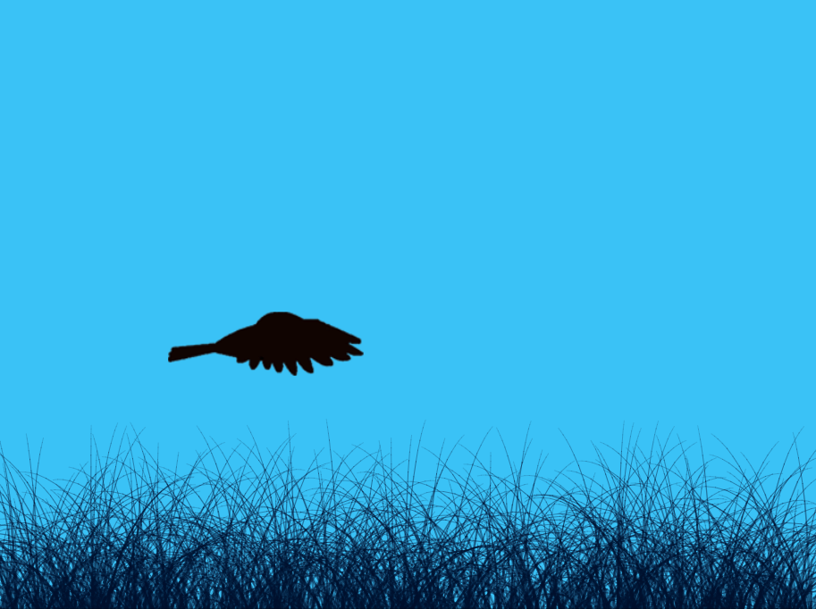
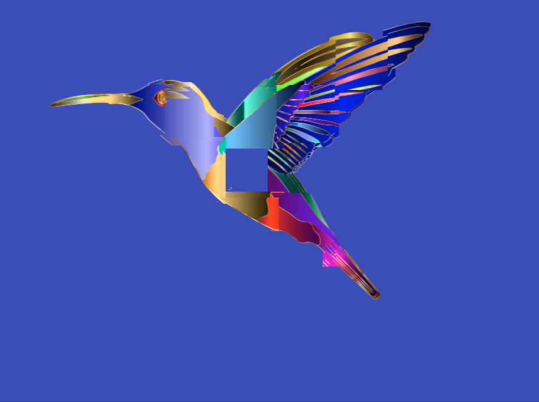
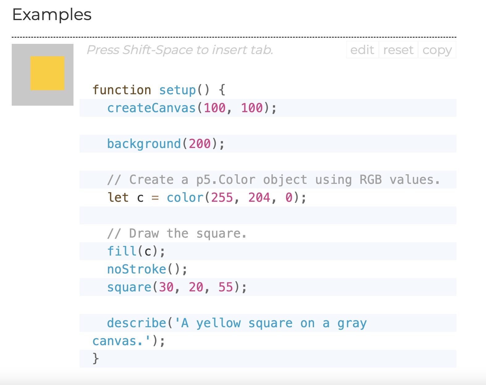
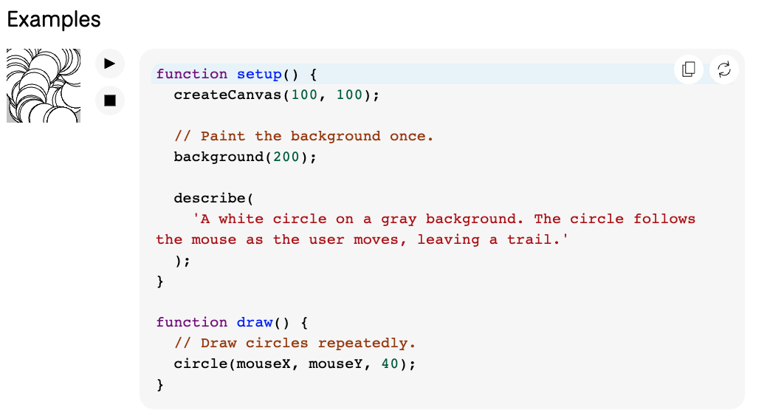

# QUIZ8
### Part 1: Imaging Technique Inspiration
-Our group has selected Dove of Peace by Pablo Picasso, one of his most iconic and symbolic works. Created in the post-World War II era, the image reflects Picasso’s strong advocacy for peace and has become a universal emblem of hope and nonviolence.

 
 

-The two images I chose both feature birds, but have very different visual styles. Image 1 features a silhouette of a bird flying low over a richly textured grassy field, evoking a calm, natural environment. Image 2, on the other hand, is a brightly colored abstract bird composed of bold gradients and geometric distortions, creating a futuristic sense of movement. I chose these two images because they contrast animated aesthetics and digital aesthetics, and I wanted to apply this feeling to the personal part of my project.
 
 
 
 

### Part 2: Coding Technique Exploration

- Use color () to fill in the square color
 
 

[Link Text](https://p5js.org/reference/#/p5/color)

-  The draw() function can be used to implement animation effects. draw() is a core function in p5.js that loops through the program at runtime to create dynamic images and respond to interactions. In projects, this looping mechanism is ideal for expressing the dynamism of a bird in flight, such as controlling an image to move or change on the screen to simulate flying.
 
 

[Link Text](https://p5js.org/reference/p5/draw/)
